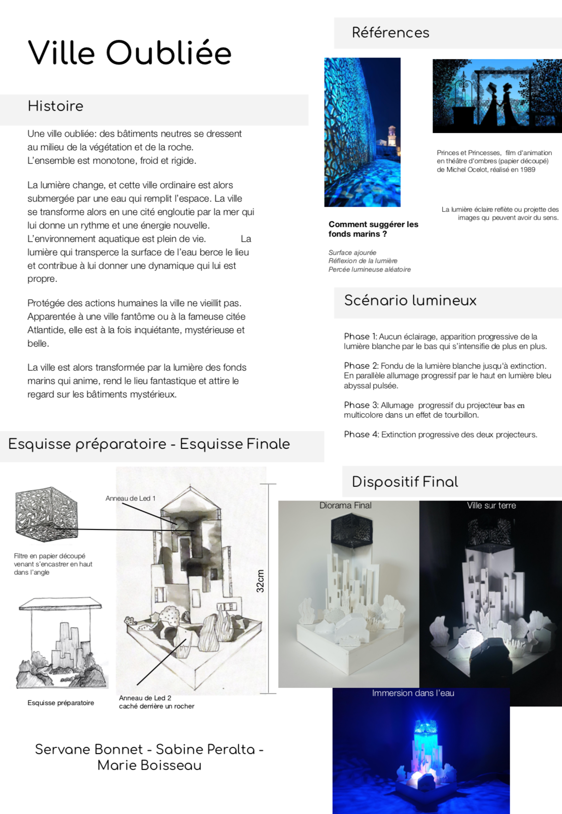
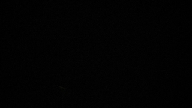
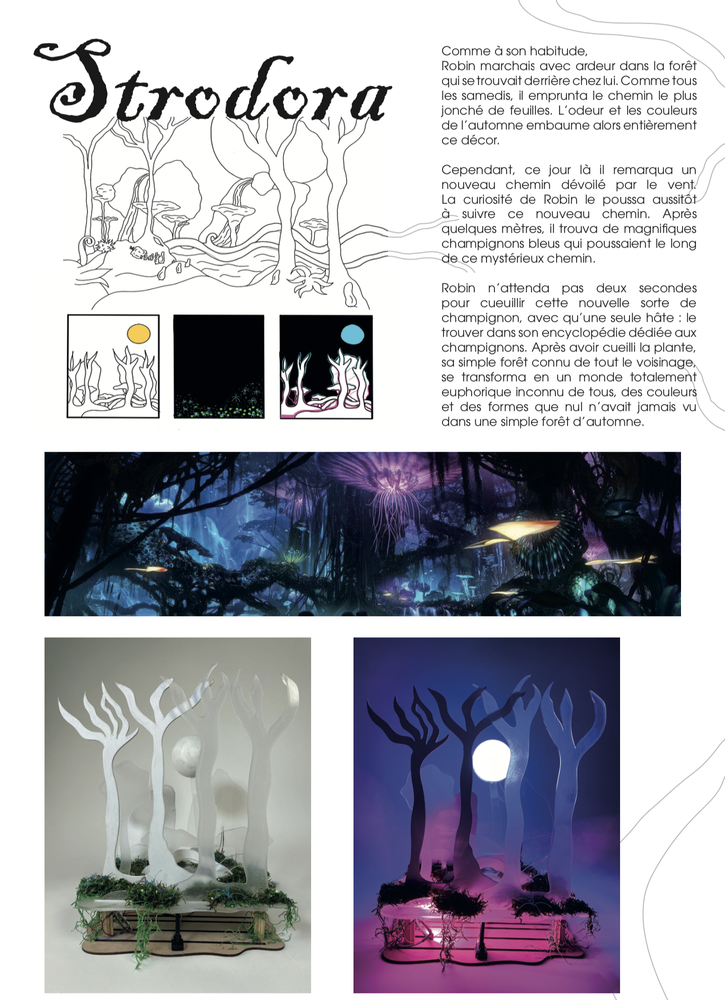

# workshop_diorama_lumiere_2020

Ce dépot regroupe les projets réalisés par des étudiants en deuxième année d'option scénographie à l'école de design Nantes Atlantique dans le cadre d'un workshop dédié à la lumière et au maquettage. Les scénari lumière sont developpés à l'aide d'[arduino](https://www.arduino.cc/)

This repo stores the projects done by scenography students at l'École de design Nantes Atlantique during a workshop dedicated to modelling and light prototyping with [arduino](https://www.arduino.cc/).

## La forêt mystérieuse

**par Salomé Hybert, Jeanne Lartiguevielle et Anelise Robbe**

## Ville oubliée

**par Marie Boisseau, Servanne Bonnet et Sabine Peralta**

## Stodoria 

**par Marie Leonore Guidicelli, Mattéo Merand et Orlane Quitin**

    